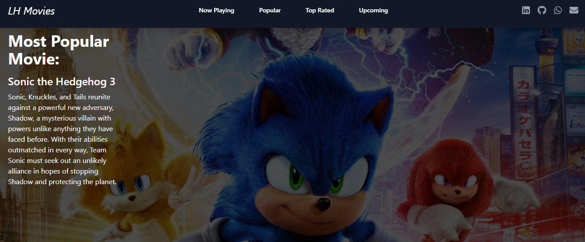
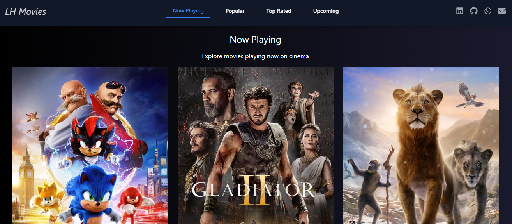
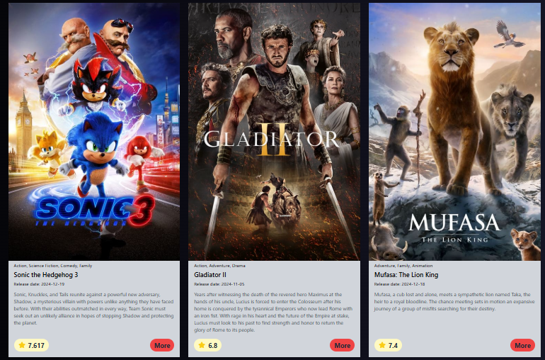
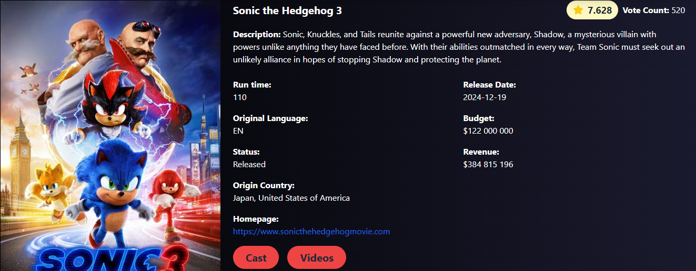

 

[English](#personal-project-next---22) | [Português](#projeto-pessoal-next---22) | [Images](#images)  

# Personal Project Next - 22

This is a personal project aimed at learning Next.js. The main focus is to explore basic configurations such as pagination, dynamic routes, active links, native caching, TypeScript integration, and other essential framework features. This project was developed to consolidate knowledge and best practices when using Next.js.

## 📁 Project Access  
[See the final project in action](https://next-22.vercel.app/).

## ✔️ Techniques and technologies used  
- **HTML/CSS**: Used for markup and styling.  
- **Typescript**: Used to add static typing to JavaScript, increasing code security.  
- **React Hooks**: Used hooks such as useState, useEffect, and useParams to manage state and side effects.  
- **NEXT.js**: Framework used for rendering static and dynamic pages with excellent performance.  
- **Active Link**: Improved navigation with visual indications of active links.  
- **Next.js Pagination**: Implemented to organize and display data across multiple pages.  
- **Fetch / Cache**: Leveraged Next.js' native function to optimize requests and cache data.  
- **Dynamic Route**: Configured to create pages based on dynamic URL parameters.  
- **Environment Variable**: Created to protect API keys used in the project.  
- **Shadcn UI**: Used to create modern and visually appealing components like Navbar and spinner.  
- **Tailwind.css**: Employed for styling and building responsive layouts efficiently.  
- **Infinite Pagination**: Added to elegantly and smoothly merge new pages with previous ones.  
- **Git/GitHub**: Tools used for version control and code hosting.  
- **Vercel**: Platform used to publish and host the project.  

---

# Projeto Pessoal Next - 22

Este é um projeto pessoal com o objetivo de aprendizado em Next.js. O foco principal é explorar configurações básicas, como paginação, rotas dinâmicas, links ativos, cache nativo, integração com TypeScript e outras funcionalidades essenciais do framework. Esse projeto foi desenvolvido para consolidar conhecimentos e práticas recomendadas no uso do Next.js.

## 📁 Acesso ao projeto  
[Veja o projeto final do curso em funcionamento](https://next-22.vercel.app/).

## ✔️ Técnicas e tecnologias utilizadas  
- **HTML/CSS**: Utilizados para marcação e estilização.  
- **Typescript**: Utilizado para adicionar tipagem estática ao JavaScript, aumentando a segurança do código.  
- **React Hooks**: Utilizados hooks como useState, useEffect e useParams para gerenciar estado e efeitos colaterais.  
- **NEXT.js**: Framework usado para renderização de páginas estáticas e dinâmicas com excelente desempenho.  
- **Link ativo**: Melhorou a navegabilidade com indicações visuais de links ativos.  
- **Paginação Next.js**: Implementada para organizar e exibir dados em múltiplas páginas.  
- **Fetch / Cache**: Utilizada a função nativa do Next.js para otimizar requisições e armazenar dados em cache.  
- **Rota dinâmica**: Configurada para criar páginas baseadas em parâmetros dinâmicos da URL.  
- **Variável de ambiente**: Criadas para proteger as chaves de API usadas no projeto.  
- **Shadcn UI**: Utilizado para criar componentes modernos e visualmente atraentes, como Navbar e spinner.  
- **Tailwind.css**: Empregado para estilização e construção de layouts responsivos com eficiência.  
- **Paginação infinita**: Adicionada para carregar páginas contínuas de forma elegante e suave.  
- **Git/GitHub**: Ferramentas usadas para controle de versão e hospedagem do código.  
- **Vercel**: Plataforma utilizada para publicar e hospedar o projeto.  

---

## Images

  
  
  
  
